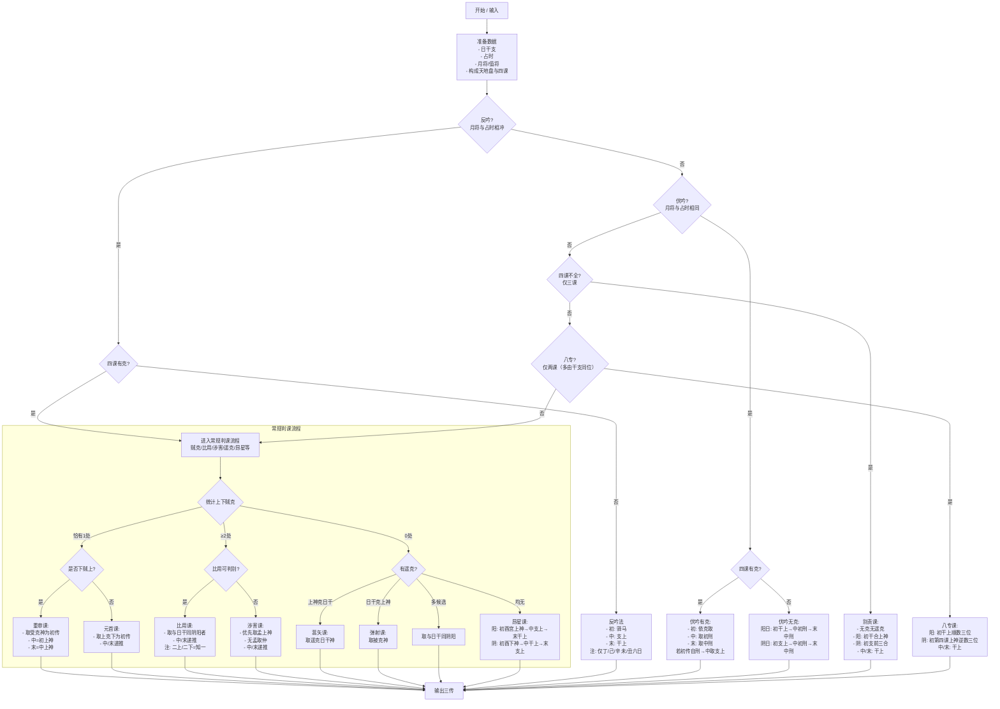

# 大六壬排盘取传流程图（按 reference.md）

本流程图总结了 reference.md 中的判课与取传顺序，便于核对规则实现。建议在支持 Mermaid 的查看器中渲染。

## 术语与判定要点

- 克/贼：
  - 上克下：上神五行克制下神五行。
  - 下贼上：下神五行克制上神五行。
- 阴阳“比”：与日干阴阳属性相同为“比”，不同为“不比”。
- 驿马（四组）：申子辰→寅；寅午戌→申；巳酉丑→亥；亥卯未→巳。
- 天干五合：甲己、乙庚、丙辛、丁壬、戊癸（取相合天干之寄宫上神）。
- 地支三合：申子辰、巳酉丑、亥卯未、寅午戌（“前三合”按顺时针上一位）。
- 刑：子卯刑；寅巳申相刑；丑戌未相刑；辰午酉亥自刑。

## 判定顺序概览

1) 先判特殊格局：反吟/伏吟（其下再视“有无克”决定是否走常规或专门规则）。
2) 再判结构缺陷：仅三课→别责；仅两课→八专（多由干支同位产生）。
3) 常规判课：
   - 1处贼克→贼克课（区分重审/元首）。
   - ≥2处贼克→比用；若“俱比或俱不比”无法区分→涉害（孟优先→仲→季）。
   - 无贼克→遥克（蒿矢/弹射，必要时比阴阳）；若无遥克→昂星（阳/阴分流）。

> 注：以上完全依据 reference.md 描述组织。如需细化“上/下神来源”“上神递推”的盘面构造，请在实现阶段进一步补充对应数据结构与取值函数。
